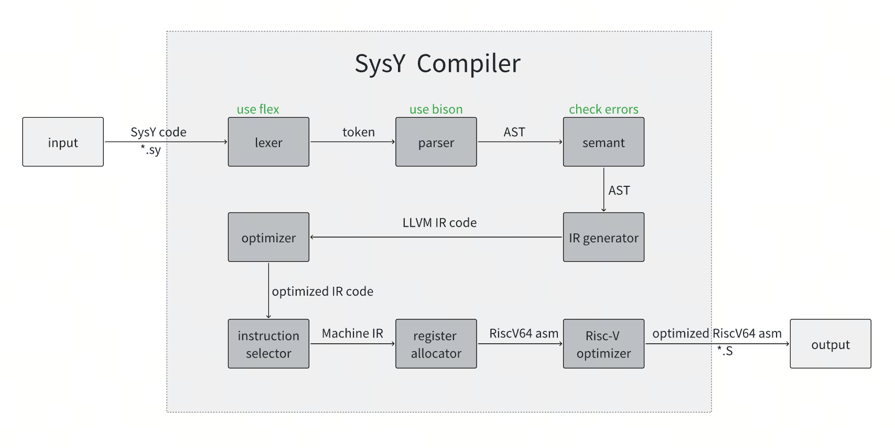

# 2025编译系统实现赛（RiscV赛道）LinguaBreak技术文档

## 编译器语言系统
- 前端：SysY2022 （详见[SysY2022语言定义](https://gitlab.eduxiji.net/csc1/nscscc/compiler2023/-/blob/master/SysY2022%E8%AF%AD%E8%A8%80%E5%AE%9A%E4%B9%89-V1.pdf)）

- 中端：LLVM IR

- 后端：Risc-V（64位）

## 开发环境及工具
- Clang 15.0+

- riscv64-unknown-linux-gnu-gcc 12.2+

- qemu-riscv64 7.0+

- flex 2.6+

- bison 3.8+

## 系统架构
### 工作流程
</img>

### 中端优化技术
#### Analysis Pass
- Build CFG

- Build Dominator Tree

- Alias Analysis

- Memdep

- Loop Analysis

- Scalar Evolution

#### Transform Pass
- mem2reg

- Simplify CFG

- Aggressive Dead Code Elimination

- Function Inline

- Peehpole

- Sparse Conditional Constant Propagation

- Tail Call Elimination

- Basic Common SubExpression elimination

- Loop Invariant Code Motion

- Loop Strength Reduce

- Loop Simplify

- Loop Rotate

### 后端优化技术
- Peephole

- Strength Reduce

## 参考仓库

本项目框架参考自[南开大学2024秋季编译原理课程教学实验](https://github.com/yuhuifishash/NKU-Compilers2024-RV64GC)


### How to complile LinguaBreak
```bash
make lexer # input: sysy_lexer.l output: sysy_lexer.cc
make parser # input: sysy_parser.y output: sysy_parser.tab.cc and sysy_parser.tab.hh
make BINARY=compiler # whole
```

### How to run LiguaBreak
```bash 
./compiler -option -o [output_file] [input_file] 
./compiler -lexer -o ./testcase/example/lexer_out.txt  ./testcase/example/temp.sy
```

### How to output file struct
```bash
tree -L 3
```

### 使用自动测试脚本
```bash
mkdir -p test_output/functional_testIR/
python grade.py 3 0 [curr/last]
```

### 测试自己的中间代码
```bash
./compiler -llvm -o ./test_output/example/temp.out.ll ./test_output/example/temp.sy
clang test_output/example/temp.out.ll -c -o test_output/example/temp.o -w
clang -static  test_output/example/temp.o ./lib/libsysy_x86.a ./lib/libloop_parallel_x86.a -o test_output/example/temp
./test_output/example/temp (< ./testcase/functional_test/Advanced/lisp2.in)
```

### 测试llvm-pass的优化效果
```bash
opt -opaque-pointers=1 -passes=tailcallelim input.ll -S -o output.ll # 以尾递归优化为例
opt -opaque-pointers=1 -passes=tailcallelim ./test_output/example/temp.ll -S -o ./test_output/example/temp-O1.ll
```

### 编译并运行自己的汇编代码
```bash
./compiler -S -o ./test_output/example/temp.out.S ./test_output/example/temp.sy -O1
riscv64-unknown-linux-gnu-gcc  "test_output/example/temp.out.S" -c -o "test_output/example/tmp.o"
riscv64-unknown-linux-gnu-gcc -mcmodel=medany -static "test_output/example/tmp.o" lib/libsysy_riscv.a lib/libloop_parallel_riscv.a
qemu-riscv64 ./a.out (< ./testcase/functional_test/Advanced/lisp2.in)
echo $?
```
利用clang生成riscv汇编代码
``` bash
llc -mtriple=riscv64-unknown-linux-gnu -mattr=+m,+a,+f,+d,+c -opaque-pointers test_output/example/temp.out.ll -o test_output/example/temp.out.S
```

### generate CFG bash
``` bash
chmod +x ~/LinguaBreak/generate_cfg.sh 
sudo ./generate_cfg.sh
```

### OutPut Error 段错误相关
OutPut Error 段错误相关, 可以借助如下命令行指令获取具体的错误位置
对于流图无法绘制的情况，下列指令也可以很好的查到
``` bash
llvm-as-18 test_output/example/temp.out.ll
```

### 使用gdb调试

- **方式一**: 使用gdb终端调试
```bash
# 1. 确保你编译时加了 -g 开启调试信息
make clean-all && make CXXFLAGS="-g"

# 2. 使用 gdb 启动程序
gdb --args ./bin/SysYc ./test_output/example/temp.sy -llvm ./test_output/example/temp.out.ll -O1

# 3. 在 gdb 中运行程序
(gdb) run

# 4. 程序崩溃后输入：
(gdb) bt
```
- **方式二**: 使用vscode界面调试

```bash
# 1.直接生成调试目标，你将得到 带有调试信息的compiler-dbg可执行文件
make debug
# 2.在.vscode/launch.json中配置参数↓，其余参数自定
"program": "${workspaceFolder}/compiler-dbg",
# 3.执行调试
# 4.清理调试时生成的文件
make clean-dbg
```


```
Your Syntax Tree Structure
│
├── ASTNode (base)
│   ├── line: int
│   ├── attribute: NodeAttribute
│   ├── codeIR(): virtual
│   ├── TypeCheck(): virtual
│   ├── printAST(): virtual
│
├── __ExprBase (ExprNode)
│   ├── Exp
│   │   └── addExp: ExprBase
│   ├── ConstExp
│   │   └── addExp: ExprBase
│   ├── Binary Expressions
│   │   ├── AddExp (left, op, right)
│   │   ├── MulExp (left, op, right)
│   │   ├── RelExp (left, op, right)
│   │   ├── EqExp (left, op, right)
│   │   ├── LAndExp (left, op, right)
│   │   └── LOrExp (left, op, right)
│   ├── Lval (VariableNode + ArefNode)
│   │   ├── name: Symbol*
│   │   └── dims: vector<ExprBase>*
│   ├── FuncCall (FuncallNode)
│   │   ├── name: Symbol*
│   │   └── funcRParams: ExprBase
│   ├── UnaryExp
│   │   ├── unaryOp: OpType
│   │   └── unaryExp: ExprBase
│   ├── Literals
│   │   ├── IntConst (IntegerLiteralNode)
│   │   ├── FloatConst (FloatLiteralNode)
│   │   └── PrimaryExp (wrapper)
│
├── __Stmt (StmtNode)
│   ├── AssignStmt (AssignNode)
│   │   ├── lval: ExprBase
│   │   └── exp: ExprBase
│   ├── ExprStmt (ExprStmtNode)
│   │   └── exp: ExprBase
│   ├── BlockStmt (BlockNode)
│   │   └── b: Block
│   ├── IfStmt (IfNode)
│   │   ├── Cond: ExprBase
│   │   ├── ifStmt: Stmt
│   │   └── elseStmt: Stmt
│   ├── WhileStmt (WhileNode)
│   │   ├── Cond: ExprBase
│   │   └── loopBody: Stmt
│   ├── ContinueStmt (ContinueNode)
│   ├── BreakStmt (BreakNode)
│   └── RetStmt (ReturnNode)
│       └── retExp: ExprBase
│
├── __Def
│   ├── VarDef/VarDef_no_init
│   │   ├── name: Symbol*
│   │   ├── dims: vector<ExprBase>*
│   │   └── init: InitValBase
│   └── ConstDef
│       ├── name: Symbol*
│       ├── dims: vector<ExprBase>*
│       └── init: InitValBase
│
├── __DeclBase
│   ├── VarDecl
│   │   ├── type_decl: Type*
│   │   └── var_def_list: vector<Def>*
│   └── ConstDecl
│       ├── type_decl: Type*
│       └── var_def_list: vector<Def>*
│
├── __Block (BlockNode)
│   └── item_list: vector<BlockItem>*
│
├── __FuncFParam
│   ├── type_decl: Type*
│   ├── dims: vector<ExprBase>*
│   └── name: Symbol*
│
├── __FuncDef
│   ├── return_type: Type*
│   ├── name: Symbol*
│   ├── formals: vector<FuncFParam>*
│   └── block: Block
│
└── __Program
    └── comp_list: vector<CompUnit>*
```

### 绝世好书
- https://understanding-llvm-transformation-passes.readthedocs.io/en/latest/index.html
- 南京大学编译优化教材：https://cs.nju.edu.cn/tiantan/courses/compiler-2023/projects/Project_5.pdf
